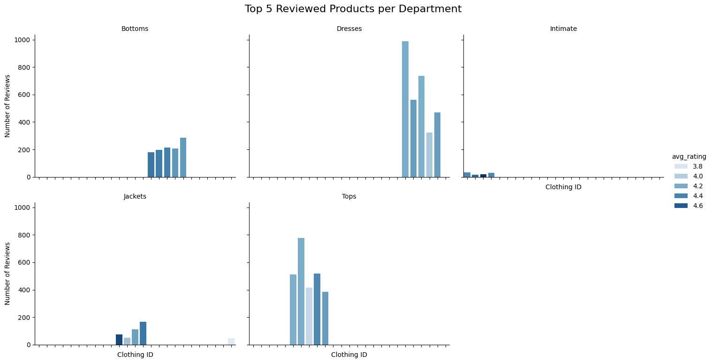
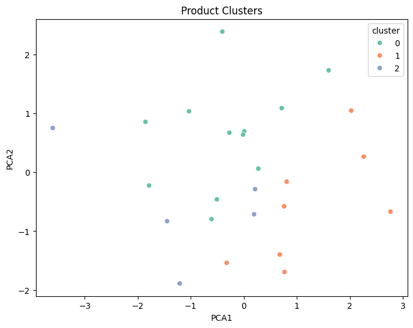
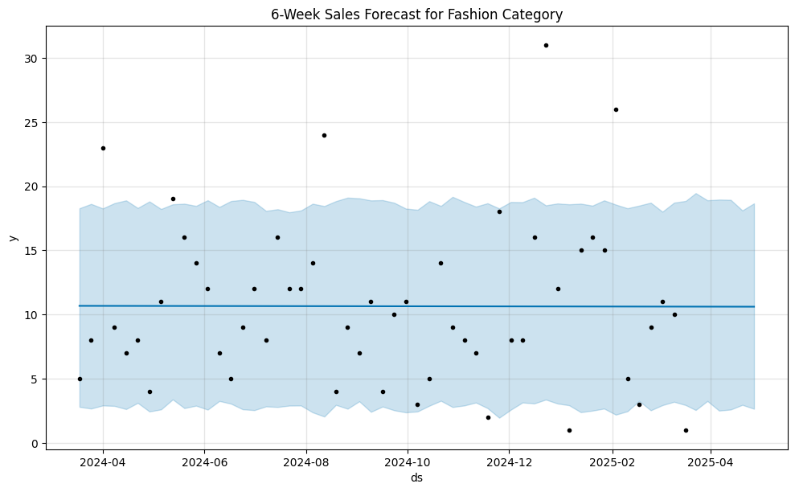

# 👗 Capstone Project: Fashion Merchandise Planning

This capstone project applies advanced analytics to replicate the role of a **retail merchandise planner**. By integrating forecasting models, sentiment analysis, and SKU-level clustering, this project empowers data-driven decision-making across assortment, pricing, and marketing strategies.

The analysis combines structured and unstructured datasets, statistical modeling, and interactive visualizations to uncover consumer preferences, identify top-performing products, and anticipate future sales demand.

---

## 🎯 Objectives

- Forecast weekly sales trends to support inventory and demand planning.
- Analyze customer reviews to quantify satisfaction across departments and products.
- Segment SKUs based on performance and sentiment to support targeted merchandising.
- Visualize key KPIs through a professional Tableau dashboard for executive-level reporting.

---

## 🧰 Tools & Technologies

- **Python**: `pandas`, `NumPy`, `matplotlib`, `seaborn`, `Prophet`, `scikit-learn`, `TextBlob`, `NLTK`
- **Data Visualization**: Tableau (interactive KPI dashboard)
- **Data Sources**:
  - *Women’s E-commerce Clothing Reviews* (Kaggle)
  - *Synthetic Fashion Retail Sales Data*

---

## 🔍 Key Analytical Components

### 🗣 Sentiment Analysis
- Cleaned and preprocessed customer reviews.
- Applied **TextBlob** to generate sentiment polarity scores.
- Identified departments with the highest median sentiment (e.g., **Intimates** and **Dresses**).
- Insight: High sentiment aligns with stronger brand affinity and loyalty potential.

### 📦 SKU-Level Insights
- Aggregated metrics by **Department Name** and **Clothing ID**.
- Ranked products by review count, sentiment, and ratings.
- Identified best-performing items for **promotion, restocking**, and **flagship product strategies**.

### 📈 Forecasting with Prophet
- Built time series models using **Facebook Prophet**.
- Forecasted weekly sales volume to detect demand cycles and seasonality.
- Useful for **supply chain optimization** and **markdown planning**.

### 🧪 Clustering Analysis
- Performed dimensionality reduction using **PCA**.
- Applied **K-Means** clustering to group SKUs based on pricing, sentiment, and performance.
- Revealed strategic clusters for **differentiated inventory control** and **pricing strategies**.

---

## 📊 Interactive Tableau Dashboard

👉 **[View Interactive Dashboard](https://us-east-1.online.tableau.com/t/pshrest6-742e148f0f/views/Customerinsightsdashboard/Dashboard1)**

> Explore customer sentiment by department, sales distribution, top SKUs, and forecast visualizations.

---

## 📈 Example Visuals
> *(Add screenshots into `/visuals/` folder and reference them below)*

- 
- 
- 
- 
- 
- 
- 
- 
---

## 💡 Business Impact Summary

| Use Case | Insight | Action |
|----------|---------|--------|
| Product Planning | Dresses & Intimates have highest sentiment | Prioritize in marketing & restocking |
| Customer Insights | Sentiment analysis reveals satisfaction trends | Refine designs and customer care strategy |
| Inventory Planning | Sales forecasts highlight demand cycles | Adjust purchase orders accordingly |
| Merchandising | SKU clustering identifies performance tiers | Customize markdown/pricing by group |

---

## 👤 About Me

**Priscilla Shrestha**  
📍 MS Business Analytics | Retail-Focused Data Analyst  
🔗 [LinkedIn](https://www.linkedin.com/in/priscilla-shrestha-083b781b5/)  
📫 priscillastha@gmail.com 

---

*This project was completed as part of the MS in Business Analytics Capstone at Kent State University. It reflects end-to-end analytics capability from data cleaning to insight storytelling.*

